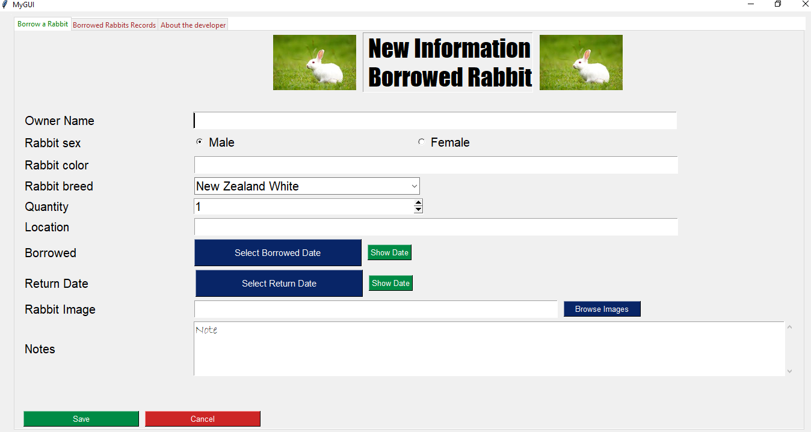

# RabbitUI 🐰🐇
- Created using python and PySimpleGUI, refer to official docs or [site](http://www.PySimpleGUI.com)
- short quick doc [here](screenshots/doc.pdf)
- After a run, go full screen to see the full window

## Motive
- Home rabbit rearing project, need to log rabbit data to a permanent storage rather than books manually
- The keeper can keep track of who borrowed his rabbit (usually for mating purposes)
- Also keep track of the rabbits that he borrowed too
- Also add notes and other useful information

### Making a standalone application
- Use `pyinstaller` to convert it to `.exe` . Check pyinstaller docs
```bash
$ pyinstaller rabbit_gui.py
```

### Run
- See sample demo GUI from the author by running [demo.py](demo.py)
- Run [rabbit_gui.py](rabbit_gui.py)
```bash
$ python rabbit_gui.py
```

## DEMO


- main / home


- insert date


- table


### Fonts
- Impact
- Helvetica
- Bradley Hand ITC
- Berlin Sans FB
- Courier New
- Elephant
- Broadway
- Comic Sans MS
- Ink Free
- Calibri

### Todo
- Use `tempfile` to store file on frequent table frames operation rather than using lists
- Anything to make it better

### Notes
- Released for free of use
- If you find it interesting, `STAR` 🌟 , `FOLLOW` it motivates 😉
- any issues.. `RAISE AN ISSUE`